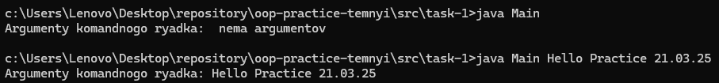

# ООП - Task 1

## Завдання
Написати просту консольну програму, яка виводить аргументи командного рядка.

## Опис програми
Програма написана мовою Java, виводить аргументи командного рядка. Якщо аргументів немає, програма повідомляє про це.

### Код програми
```java
public class Main {
    public static void main(String[] args) {
        System.out.print("Argumenty komandnogo ryadka: ");
        if (args.length == 0) {
            System.out.println(" nema argumentov ");
        } else {
            for (String arg : args) {
                System.out.print(arg + " ");
            }
            System.out.println();
        }
    }
}
```
## Результат:




