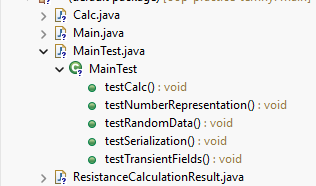
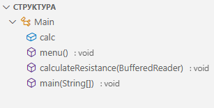
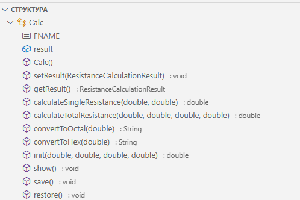
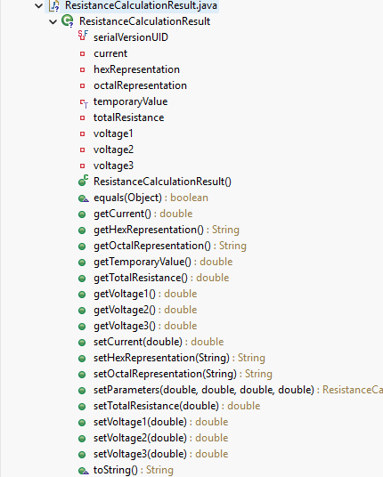
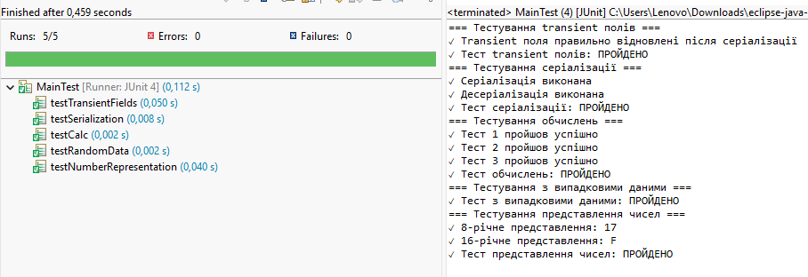
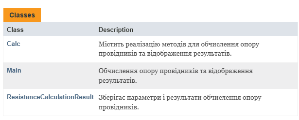
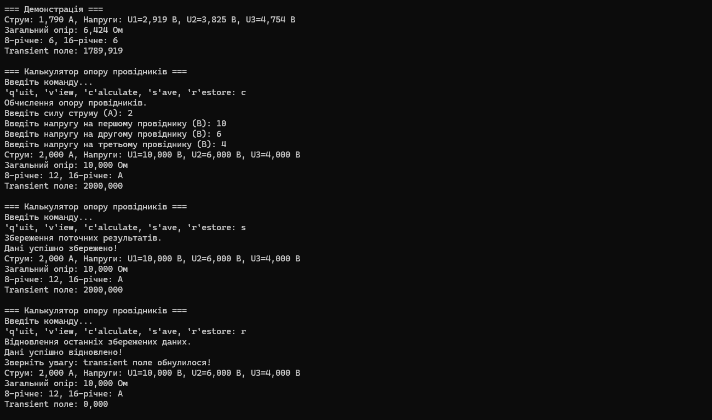

# ООП - Task 2

## Завдання

### 1. Базова серіалізація:
- Розробити клас, що серіалізується, для зберігання параметрів і результатів обчислень.
- Використовуючи агрегування, розробити клас для знаходження рішення задачі.

### 2. Робота з транзитними полями:
- Розробити клас для демонстрації в діалоговому режимі збереження та відновлення стану об'єкта, використовуючи серіалізацію.
- Показати особливості використання transient полів.

### 3. Тестування:
- Розробити клас для тестування коректності результатів обчислень та серіалізації/десеріалізації.
- Використовувати докладні коментарі для автоматичної генерації документації засобами javadoc.

**Індивідуальне завдання №17:** Визначити 8-річне та 16-річне уявлення цілісного значення загального електричного опору трьох послідовно з'єднаних провідників при заданому постійному струмі та відомій напрузі на кожному провіднику.

## Виконання

### 1. Базова серіалізація
- **ResistanceCalculationResult.java** - серіалізований клас для зберігання параметрів і результатів
- **Calc.java** - клас з агрегуванням для знаходження рішення задачі

### 2. Робота з транзитними полями
- **Main.java** - демонстрація в діалоговому режимі збереження та відновлення стану об'єкта
- Використання transient полів для 8-річного та 16-річного представлення опору

### 3. Тестування
- **MainTest.java** - клас для тестування коректності результатів обчислень та серіалізації/десеріалізації
- Повні Javadoc коментарі для автоматичної генерації документації

## Структура файлів
- Main.java - основна програма з меню
- Calc.java - клас обчислень з агрегуванням
- ResistanceCalculationResult.java - серіалізований клас результатів
- MainTest.java - JUnit тести

## Запуск програми
```bash
# Запуск JAR-файлу
java -jar task2.jar
```
> **Примітка:**  
> JAR-файл `task2.jar` знаходиться у папці  
> `repository\oop-practice-temnyi\src\task-2`
### Структура проекту


### Структура класів




### Результати тестування


### Javadoc документація


## Результати роботи
!
[](program1-1.png) 


