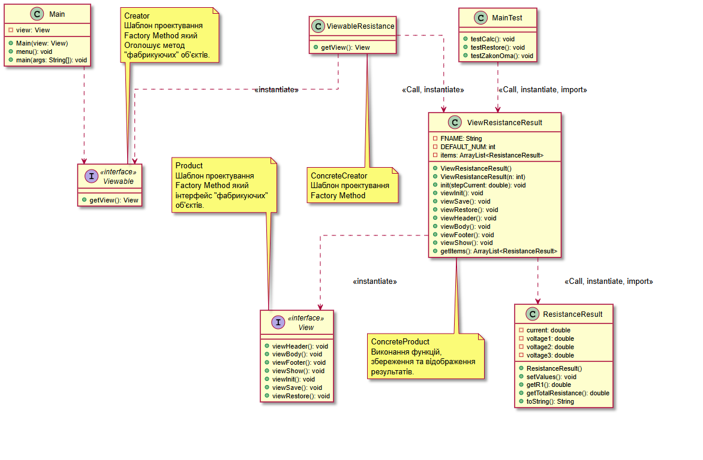
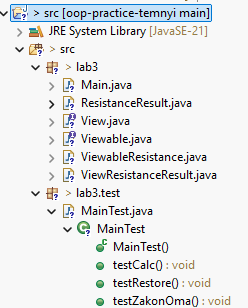
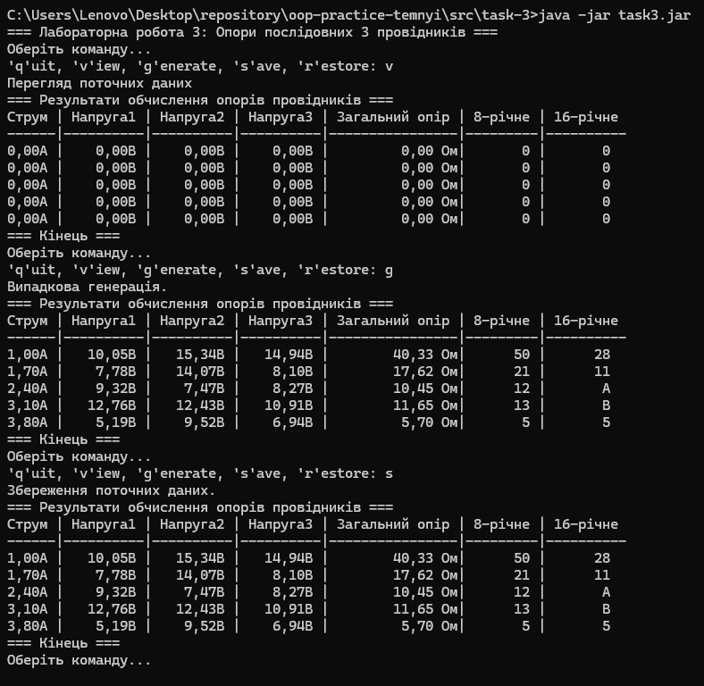
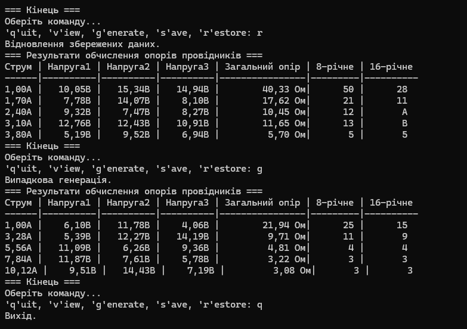
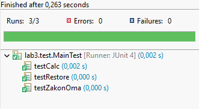
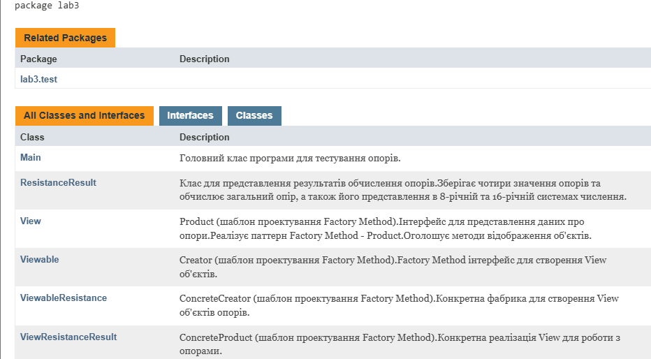

# ООП - Task 3

## Завдання

### 1. Використання попередньої лабораторної роботи
Як основу використовувати вихідний текст проекту попередньої роботи. Забезпечити розміщення результатів обчислень у колекції з можливістю збереження/відновлення.

### 2. Шаблон проектування Factory Method
Використовуючи шаблон проектування Factory Method (Virtual Constructor), розробити ієрархію, що передбачає розширення за рахунок додавання нових класів, що відображаються.

### 3. Інтерфейс "фабрикованих" об'єктів
Розширити ієрархію інтерфейсом об'єктів, що "фабрикуються", що представляють набір методів для відображення результатів обчислень.

### 4. Методи виведення результатів
Реалізувати ці методи виведення результатів у текстовому вигляді.

### 5. Інтерфейс "фабрикуючого" методу
Розробити та реалізувати інтерфейс для "фабрикуючого" методу.

**Додаткові вимоги:**
- Забезпечити діалоговий інтерфейс із користувачем
- Розробити клас для тестування основної функціональності
- Використати коментарі для автоматичного створення документації засобами javadoc

**Індивідуальне завдання №17:** Визначити 8-річне та 16-річне уявлення цілісного значення загального електричного опору трьох послідовно з'єднаних провідників при заданому постійному струмі та відомій напрузі на кожному провіднику.

## Виконання завдання

### 1. Використання попередньої лабораторної роботи
- **ResistanceResult.java** - клас з task-2 для зберігання параметрів і результатів обчислень з транзитними полями
- **ArrayList<ResistanceResult>** - колекція для розміщення результатів обчислень з можливістю збереження/відновлення через серіалізацію

### 2. Шаблон проектування Factory Method (Virtual Constructor)
Розроблено ієрархію класів, що передбачає розширення за рахунок додавання нових відображуваних класів:

- **Viewable.java** - Creator інтерфейс для "фабрикуючого" методу
- **ViewableResistanceResult.java** - ConcreteCreator, реалізує створення об'єктів відображення

### 3. Інтерфейс "фабрикованих" об'єктів
Розширено ієрархію інтерфейсом **View**, що представляє набір методів для відображення результатів обчислень:
- `viewHeader()` - відображення заголовку
- `viewBody()` - відображення основної частини
- `viewFooter()` - відображення закінчення
- `viewShow()` - відображення об'єкта цілком
- `viewInit()` - ініціалізація даних
- `viewSave()` - збереження даних
- `viewRestore()` - відновлення даних

### 4. Методи виведення результатів у текстовому вигляді
Реалізовано методи виведення результатів у текстовому вигляді у класі **ViewResistanceResult**:
- Табличне представлення результатів обчислень
- Форматування даних з точністю до сотих
- Відображення 8-річного та 16-річного представлення опору

### 5. Інтерфейс "фабрикуючого" методу
- **View.java** - Product інтерфейс "фабрикованих" об'єктів
- **ViewResistanceResult.java** - ConcreteProduct, реалізує методи відображення результатів
- **Viewable.java** містить метод `getView()` для створення об'єктів відображення

### Додаткові компоненти

#### Діалоговий інтерфейс з користувачем
**Main.java** - забезпечує діалоговий інтерфейс з командами:
- `q` - вихід з програми
- `v` - перегляд поточних результатів
- `g` - генерація нових випадкових значень
- `s` - збереження поточних даних
- `r` - відновлення збережених даних

#### Тестування основної функціональності
**MainTest.java** - клас для тестування з методами:
- `testCalc()` - перевірка основної функціональності класу ViewResistanceResult
- `testRestore()` - перевірка коректності відновлення даних під час серіалізації
- `testZakonOma()` - перевірка правильності обчислень за законом Ома

## Засоби ООП, що використовувалися

### Інтерфейси та їх реалізація
Використано принцип програмування через інтерфейси для забезпечення гнучкості та розширюваності системи.

### Колекції
Використано `ArrayList<ResistanceResult>` для зберігання групи результатів обчислень з можливістю серіалізації.

### Factory Method Pattern
Реалізовано виробляючий шаблон проектування Factory Method (Virtual Constructor), що визначає стандартний метод створення об'єкта, не пов'язаний із викликом конструктора.

## Cтруктура класів


## Структура файлів

 
## Запуск програми

```bash
# Запуск JAR-файлу
java -jar task3.jar
```
> **Примітка:**  
> JAR-файл `task3.jar` знаходиться у папці  
> `repository\oop-practice-temnyi\src\task-3`

## Результати роботи




### Результати JUnit тестування


### Javadoc документація
