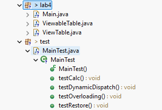
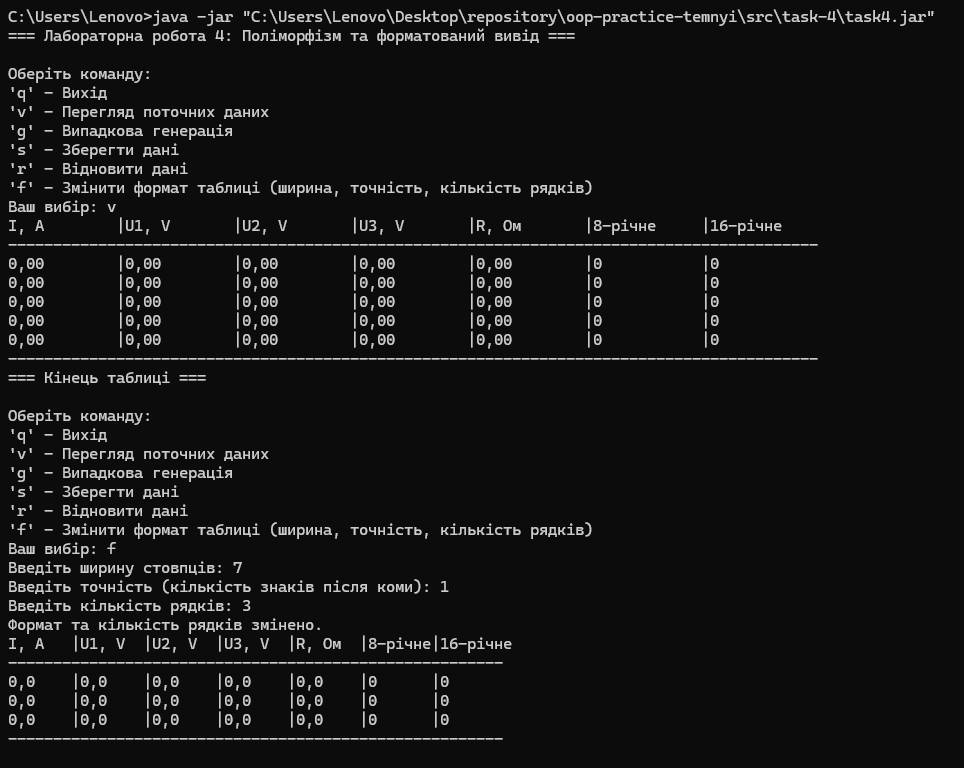
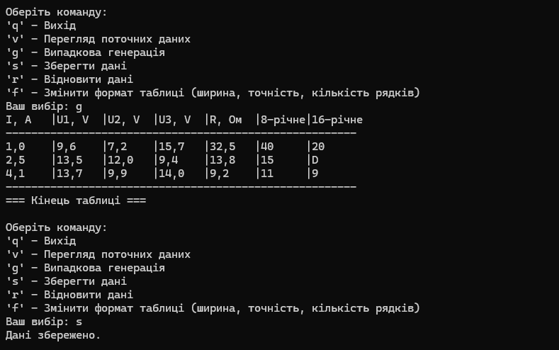
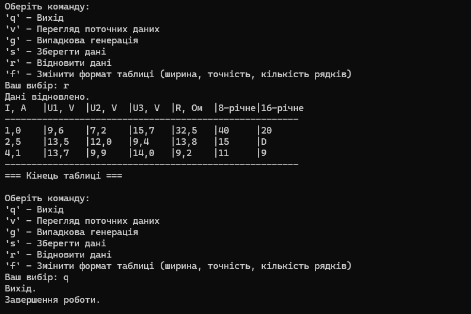
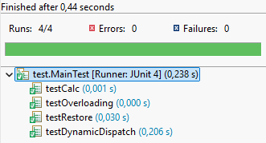
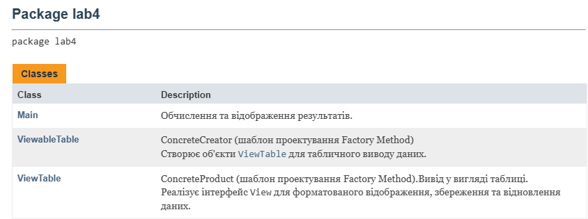

# ООП - Task 4

## Завдання

### 1. Використання попередньої лабораторної роботи
Як основу використовувати вихідний текст проекту попередньої роботи. Використовуючи шаблон проектування Factory Method (Virtual Constructor), розширити ієрархію похідними класами, які реалізують методи для подання результатів у вигляді текстової таблиці. Параметри відображення таблиці мають визначатися користувачем.

### 2. Перевизначення, перевантаження, поліморфізм
Продемонструвати заміщення (перевизначення, overriding), поєднання (перевантаження, overloading), динамічне призначення методів (пізнє зв'язування, поліморфізм, dynamic method dispatch).

### 3. Діалоговий інтерфейс
Забезпечити діалоговий інтерфейс із користувачем.

### 4. Модульне тестування
Розробити клас для тестування основної функціональності.

### 5. Javadoc
Використати коментарі для автоматичного створення документації засобами javadoc.

**Індивідуальне завдання №17:** Визначити 8-річне та 16-річне уявлення цілісного значення загального електричного опору трьох послідовно з'єднаних провідників при заданому постійному струмі та відомій напрузі на кожному провіднику.

---

## Виконання завдання

### 1. Використання попередньої лабораторної роботи
- **View.java**, **Viewable.java**, **ResistanceResult.java** — імпортовані з task-3 (пакет lab3).
- **ArrayList<ResistanceResult>** — колекція для зберігання результатів обчислень з можливістю серіалізації.

### 2. Factory Method (Virtual Constructor)
Розроблено нові класи у пакеті lab4:
- **ViewableTable.java** — Creator, фабрикує об'єкти для табличного відображення.
- **ViewTable.java** — ConcreteProduct, реалізує форматований табличний вивід, параметри якого задаються користувачем.

### 3. Інтерфейс "фабрикованих" об'єктів
- **View.java** — інтерфейс з методами:
  - `viewHeader()`
  - `viewBody()`
  - `viewFooter()`
  - `viewShow()`
  - `viewInit()`
  - `viewSave()`
  - `viewRestore()`

### 4. Методи виведення результатів у текстовому вигляді
- **ViewTable.java** — реалізує табличне представлення результатів, форматування даних, відображення 8-річного та 16-річного представлення опору.

### 5. Діалоговий інтерфейс
**Main.java** — забезпечує діалоговий інтерфейс з командами:
- `q` — вихід з програми
- `v` — перегляд поточних результатів
- `g` — генерація нових випадкових значень
- `s` — збереження поточних даних
- `r` — відновлення збережених даних
- `f` — зміна формату таблиці

### 6. Тестування основної функціональності
**MainTest.java** — клас для тестування з методами:
- `testCalc()` — перевірка основної функціональності класу ViewTable
- `testRestore()` — перевірка коректності відновлення даних під час серіалізації
- `testOverloading()` — перевірка перевантаження методів
- `testDynamicDispatch()` — перевірка поліморфізму

## Засоби ООП, що використовувалися

### Інтерфейси та їх реалізація
Було розширено використання інтерфейсів: додано нові методи для табличного відображення результатів, що забезпечує більшу гнучкість і розширюваність системи.

### Абстрактні методи та класи
Абстрактні методи використовуються для визначення базових можливостей. Реалізовано конкретні методи для форматованого табличного виводу.

### Перевизначення та перевантаження
Реалізовано перевантаження та перевизначення методів для гнучкого форматування таблиці (наприклад, зміна ширини, точності, кількості рядків).

### Поліморфізм
Розширено застосування поліморфізму для роботи з різними типами відображення результатів, що дозволяє використовувати динамічне зв'язування.

### Колекції
Використано `ArrayList<ResistanceResult>` для зберігання результатів обчислень. Додано серіалізацію та нові можливості роботи з даними.

### Factory Method Pattern
Розширено і використано шаблон проектування Factory Method для створення об'єктів табличного відображення результатів. Додано нові класи (**ViewableTable**, **ViewTable**) для форматованого виводу.

## Запуск програми

```bash
# Запуск JAR-файлу 
java -jar task4.jar
```
> **Примітка:**  
> JAR-файл `task4.jar` знаходиться у папці  
> `repository\oop-practice-temnyi\src\task-4`

## Структура файлів


## Результати роботи
 

 


### Результати JUnit тестування


### Javadoc документація
