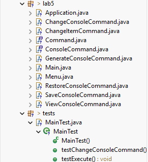
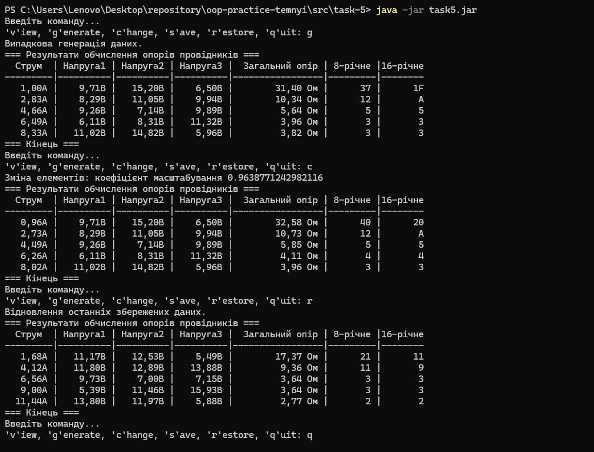
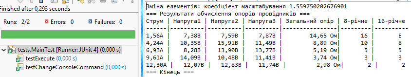
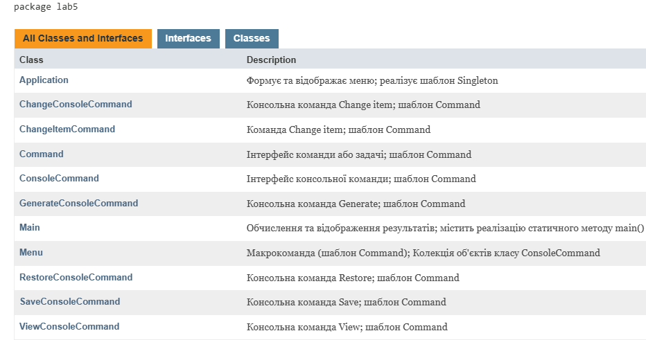

# ООП - Task 5

## Завдання

### 1. Використання попередньої лабораторної роботи
Як основу використовувати вихідний текст проекту попередньої роботи. Використовуючи шаблони проектування Command, Singleton та Factory Method, розробити клас Menu як контейнер команд, що розширюється, реалізувати обробку даних колекції та окремих елементів.

### 2. Command Pattern
Реалізувати можливість скасування (undo) операцій (команд). Продемонструвати поняття "макрокоманда". Використати шаблон Command для інкапсуляції запитів як об'єктів.

### 3. Singleton Pattern
Під час розробки програми використовувати шаблон Singleton для класу Application, що забезпечує наявність лише одного екземпляра.

### 4. Діалоговий інтерфейс
Забезпечити діалоговий інтерфейс із користувачем з можливістю виконання різних команд через консоль.

### 5. Модульне тестування
Розробити клас для тестування функціональності програми з перевіркою методів Command Pattern.

### 6. Javadoc
Використати коментарі для автоматичного створення документації засобами javadoc.

**Індивідуальне завдання №17:** Визначити 8-річне та 16-річне уявлення цілісного значення загального електричного опору трьох послідовно з'єднаних провідників при заданому постійному струмі та відомій напрузі на кожному провіднику.

---

## Виконання завдання

### 1. Використання попередньої лабораторної роботи
- **View.java**, **Viewable.java**, **ResistanceResult.java** — імпортовані з task-3 (пакет lab3).
- **ViewableTable.java** — імпортований з task-4 (пакет lab4).
- **ViewResistanceResult.java** — основний клас для відображення результатів.

### 2. Command Pattern
Розроблено систему команд у пакеті lab5:
- **Command.java** — базовий інтерфейс команди з методом `execute()`.
- **ConsoleCommand.java** — інтерфейс консольної команди з методом `getKey()`.
- **ChangeItemCommand.java** — команда Change item, реалізує Command.
- **ChangeConsoleCommand.java** — консольна команда Change item.
- **GenerateConsoleCommand.java**, **ViewConsoleCommand.java**, **SaveConsoleCommand.java**, **RestoreConsoleCommand.java** — консольні команди.

### 3. Singleton Pattern
**Application.java** — реалізує шаблон Singleton з приватним конструктором та статичним методом `getInstance()`.

### 4. Макрокоманда (Menu)
**Menu.java** — реалізує макрокоманду з колекцією `List<ConsoleCommand>` та циклічною обробкою команд користувача.

### 5. Діалоговий інтерфейс
**Main.java** — забезпечує команди: `v`, `g`, `c`, `s`, `r`, `q`.

### 6. Тестування
**MainTest.java** — тестування з методами `testExecute()` та `testChangeConsoleCommand()`.

## Засоби ООП, що використовувалися

### Command Pattern
Поведінковий шаблон для обробки команд як об'єктів. Забезпечує відокремлення джерела запиту від об'єкта-обробника.

### Макрокоманда
Колекція об'єктів Command. Menu містить підкоманди та переадресує виклики execute() всім підкомандам.

### Singleton Pattern
Забезпечує єдиний екземпляр класу Application з глобальним доступом.

### Factory Method Pattern
Створення об'єктів View через `new ViewableTable().getView()`.

### Поліморфізм та динамічне зв'язування
Робота з різними типами команд через інтерфейси Command та ConsoleCommand.

### Колекції та обробка
`ArrayList<ResistanceResult>` для результатів, `List<ConsoleCommand>` для команд. Алгоритми масштабування колекції.

### Серіалізація
Збереження та відновлення стану через серіалізацію колекції.

## Запуск програми

```bash
java -jar task5.jar
```
> **Примітка:**  
> JAR-файл `task5.jar` знаходиться у папці  
> `repository\oop-practice-temnyi\src\task-5`

## Структура файлів


## Результати роботи


### Результати JUnit тестування


### Javadoc документація
