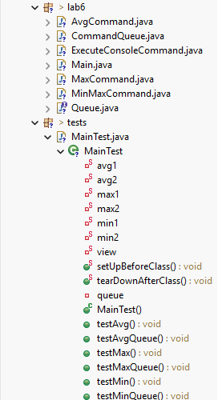
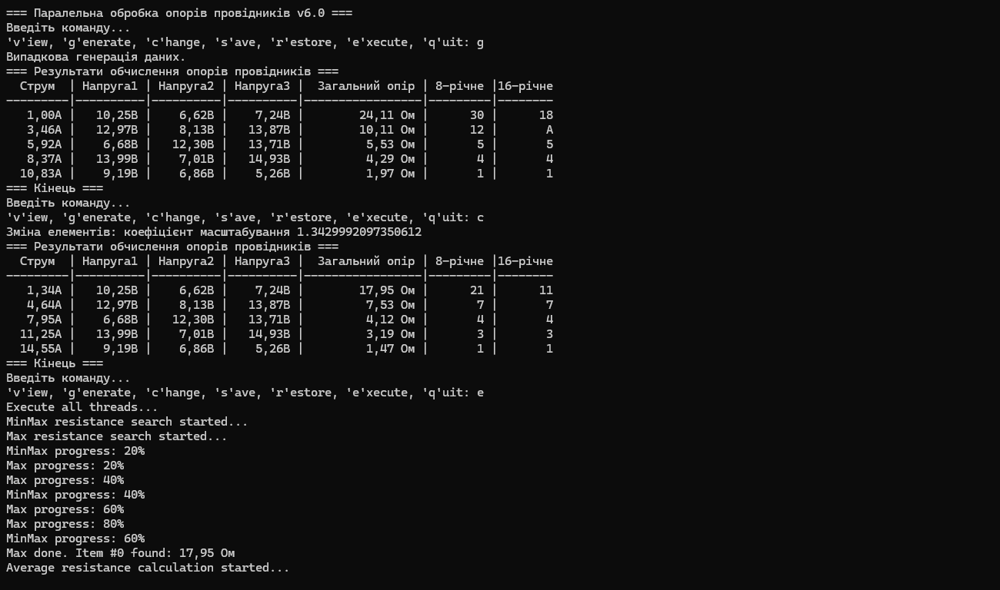
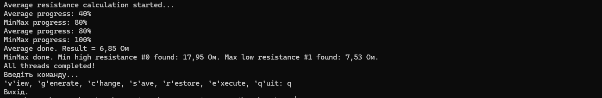
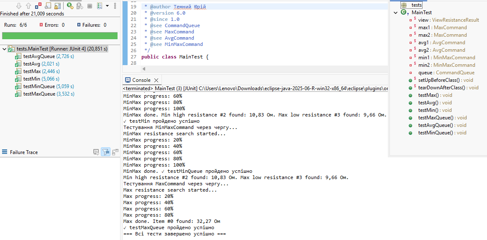
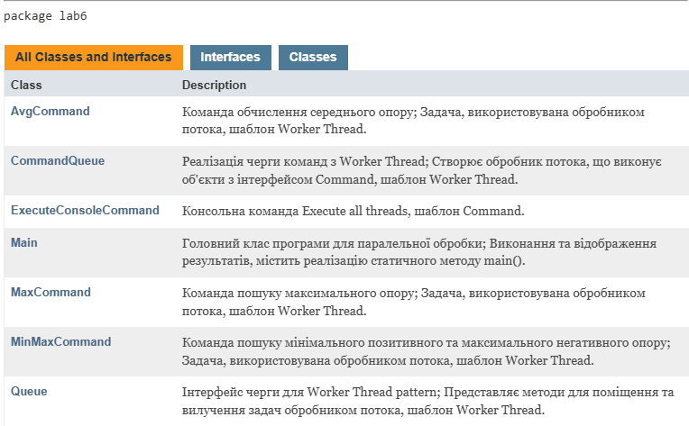

# ООП - Task 6

## Завдання

### 1. Загальне завдання
Продемонструвати можливість паралельної обробки елементів колекції (пошук мінімуму, максимуму, обчислення середнього значення, відбір за критерієм, статистична обробка тощо).

### 2. Worker Thread Pattern
Управління чергою завдань (команд) реалізувати за допомогою шаблону Worker Thread.

### 3. Діалоговий інтерфейс
Забезпечити діалоговий інтерфейс з користувачем.

### 4. Модульне тестування
Розробити клас для тестування функціональності програми.

### 5. Javadoc
Використовувати коментарі для автоматичного створення документації засобами javadoc.

---

## Виконання завдання

### 1. Використання попередньої лабораторної роботи
- **View.java**, **Viewable.java**, **ResistanceResult.java** — імпортовані з task-3 (пакет lab3).
- **ViewableTable.java** — імпортований з task-4 (пакет lab4).
- **Menu.java**, **ConsoleCommand.java**, **Command.java** — імпортовані з task-5 (пакет lab5).

### 2. Worker Thread Pattern
Розроблено систему паралельної обробки у пакеті lab6:
- **Queue.java** — інтерфейс черги для Worker Thread pattern. Визначає методи `put()` та `take()` для додавання в чергу та видалення з неї завдань.
- **CommandQueue.java** — реалізує інтерфейс Queue та створює обробник потоку, який виконує об'єкти з інтерфейсом Command.
- **CommandQueue.Worker** — внутрішній клас CommandQueue, реалізує метод run для періодичної перевірки черги на наявність готових до виконання завдань.

### 3. Команди паралельної обробки
Для паралельного виконання розроблено три класи, що реалізують інтерфейс Command:
- **MaxCommand.java** — призначений для обробки колекції об'єктів та знаходження максимального значення опору.
- **AvgCommand.java** — призначений для обробки колекції об'єктів, обчислює середнє арифметичне значення опору.
- **MinMaxCommand.java** — призначений для обробки колекції об'єктів, виконує пошук мінімального високого та максимального низького опору за критерієм.

### 4. Консольна команда
**ExecuteConsoleCommand.java** — реалізує консольну команду "Execute all threads" (шаблон Command). При виконанні методу execute() створюються дві черги завдань та виконується очікування завершення їх обробки.

### 5. Основний клас
**Main.java** — головний клас програми з ініціалізацією меню та запуском паралельної обробки.

### 6. Тестування
**MainTest.java** — комплексне тестування з методами:
- `setUpBeforeClass()` – виконується першим
- `tearDownAfterClass()` – виконується останнім
- `testMax()` – перевірка функціональності класу MaxCommand
- `testAvg()` – перевірка функціональності класу AvgCommand
- `testMin()` – перевірка функціональності класу MinMaxCommand
- `testMaxQueue()` – перевірка CommandQueue з завданням MaxCommand
- `testAvgQueue()` – перевірка CommandQueue з завданням AvgCommand
- `testMinQueue()` – перевірка CommandQueue з завданням MinMaxCommand

## Засоби ООП, що використовувалися

### Worker Thread Pattern
Обробний шаблон Worker Thread призначений для покращення пропускної спроможності та мінімізації середньої затримки при реалізації паралельного виконання. Обробник потоку вибирає з черги завдання і виконує їх в окремому потоці.

### Command Pattern
Поведінковий шаблон для інкапсуляції команд обробки даних як об'єктів (MaxCommand, AvgCommand, MinMaxCommand).

### Factory Method Pattern
Створення об'єктів View через `new ViewableTable().getView()`.

### Багатопоточність (Multithreading)
Використання потоків Java для паралельного виконання завдань. Програма ділиться на кілька незалежних завдань, що виконуються одночасно.

### Синхронізація потоків
Використання `java.util.concurrent.BlockingQueue` для безпечної передачі завдань між потоками та координації їх роботи.

### Поліморфізм
Робота з різними типами команд через інтерфейс Command для уніфікованої обробки в Worker Thread.

### Колекції та алгоритми
Обробка `ArrayList<ResistanceResult>` з реалізацією алгоритмів:
- Пошук максимального значення
- Обчислення середнього арифметичного
- Фільтрація за критерієм та пошук умовних екстремумів

## Переваги Worker Thread Pattern
1. Клієнту не потрібно створювати кілька потоків - достатньо помістити завдання у чергу
2. Мінімізація накладних витрат на планування потоків
3. Ефективне використання ресурсів обчислювальної системи
4. Покращена організація коду та зручність для користувача

## Запуск програми

```bash
java -jar task6.jar
```
> **Примітка:**  
> JAR-файл `task6.jar` знаходиться у папці  
> `repository\oop-practice-temnyi\src\task-6`

## Структура файлів


## Результати роботи

### Консольний інтерфейс та паралельна обробка


### Демонстрація паралельного виконання
Програма демонструє одночасне виконання команд у двох чергах:
- **Черга 1:** MinMaxCommand
- **Черга 2:** MaxCommand + AvgCommand
Завдання виконуються асинхронно з відображенням прогресу виконання.

### Результати JUnit тестування


### Javadoc документація

